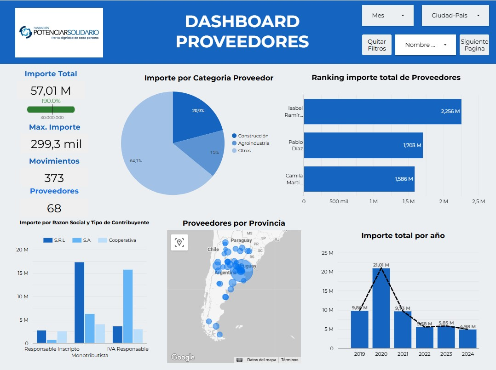
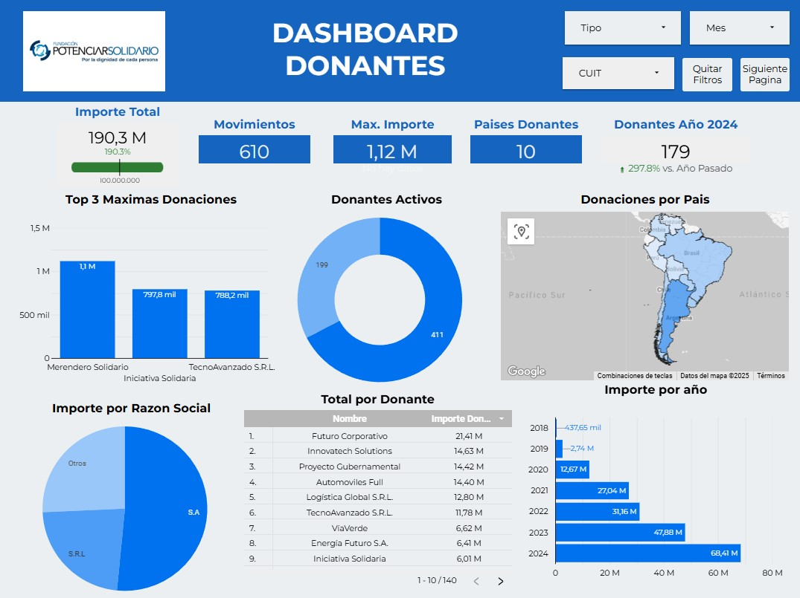
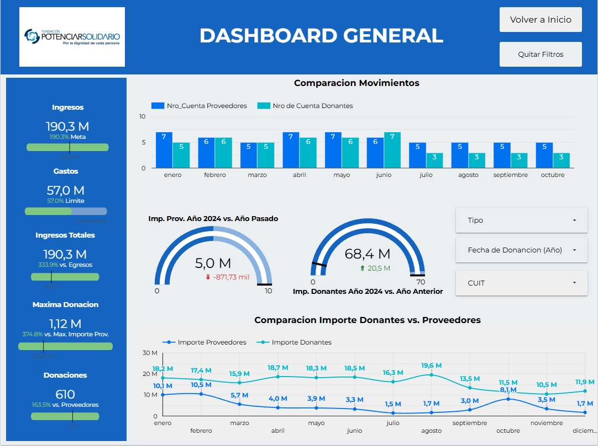

<h1 align="center"> Dashboard Looker Studio</h1>

## Descripcion del Proyecto

Este proyecto fue realizado en Looker Studio, para el cuál utilicé la base de datos proporcionada, después de limpiar los datos en google sheets, agregué columnas que me facilitarian el trabajo al momento de la visualizacion, como el prefijo del numero telefonico, para poder identificar el pais de cada donante, un ranking para saber la maxima donancion, entre otras columnas.

## Analisis del Dashboard Ingresos y Egresos

El primer dashboard es el de egresos, donde nos permite analizar el importe total por proveedores, al cual se le añadio una meta, indicando que es el maximo que se puede gastar. Además, otros indicadores como el maximo importe realizado, los movimientos y la cantidad de proveedores. Tambien tiene un ranking donde identificamos el proveedor con el que mas se trabaja. Integré un mapa para localizar cuantos proveedores hay por provincia y un grafico para identificar el importe realizado por año. Por ultimo, agregué algunos filtros para buscar algun mes o un usuario especifico.

Para el dashboard de Donantes, tambien agregue tarjetas de indicadores, como el importe total, el cual cuenta con una meta, indicando de color verde que ya fue excedida, tambien cuenta con la cantidad de movimientos, el maximo importe donado, la cantidad de paises donantes y una tarjeta de comparacion entre los donantes del año 2024 comparandolo con los del año anterior, el cual evidencia un incremento. De igual manera integre un mapa donde se muestra las donaciones realizadas por pais, un grafico circular con el estado del donante, ya que algunos se dieron de baja. Un grafico el que muestra el importe por año, el que se muestra que año a año fue incrementando y un top con las maximas donaciones.

## Descripcion del Dashboard General

En este dashboard realizamos una comparacion entre los donantes y provedoores. Empezando por los indicadores, 

