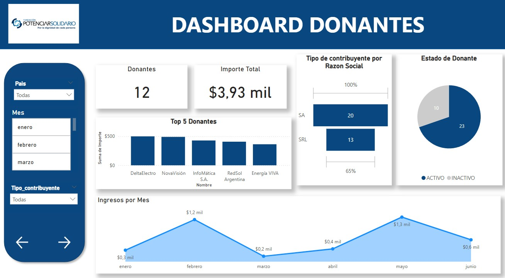
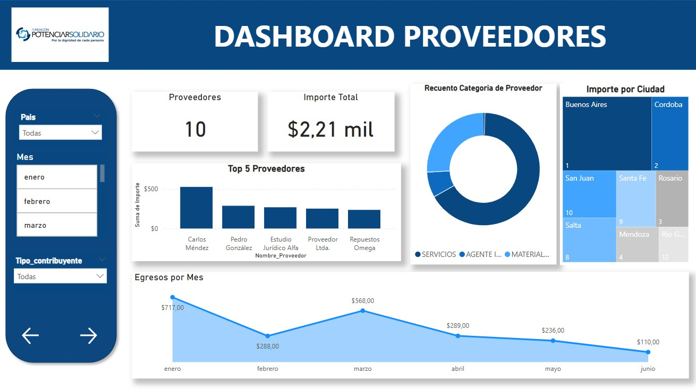
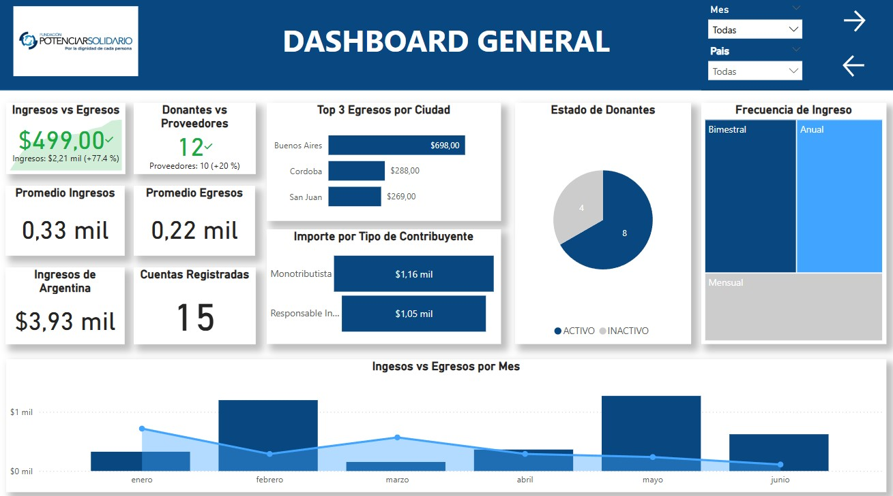

<h1 align="center"> Dashboard Power BI </h1>

## Descripcion del Proyecto

Este proyecto fue realizado en Power BI, para el cuál utilicé la base de datos proporcionada, después de limpiar los datos, los transformé, otorgandole un id a cada atributo, posterior a ello, cree los campos en Mysql y les agregué los datos.
Luego, conecte la BD a Power BI, dentro de la plataforma agregue medidas realizadas con DAX para saber el promedio de Ingresos y Egresos.

## Analisis del Dashboard Ingresos y Egresos
Este dashboard nos permite analizar lo relacionado a los ingresos obtenidos, tal como la cantidad de donaciones realizadas, la comparacion entre los donantes activos y los que no. Además, se identifica quienes son los 5 donantes con mayores contribuciones y  la cantidad de ingresos por mes.

Para el egreso funciona de manera similar, se puede identificar la cantidad de egresos y el importe total gastado, asi como los 5 proveedores con los que mas se colaboró. Tambien se identifica los egresos por mes y por pais.

<h2>Dashboard de Ingresos y Egresos</h2> 

## Descripcion del Dashboard General
Este dashboard realiza una comparacion entre los ingresos y egresos a traves de indicadores, donde se muestra un saldo positivo tanto en importe como en cantidad de donantes. Creé medidas para obtener el promedio de ingresos y egresos. También identifiqué el top 3 de egresos por ciudad y una comparación grafica entre los ingresos y egresos por mes.
<h2>Dashboard General</h2> 

